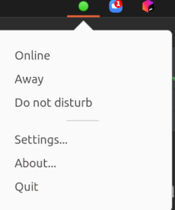
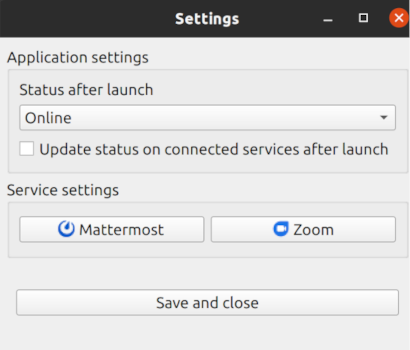

# synclair
## A multi-platform user status updater

## Features

* Set status in task bar will be applied to all connected services
* Supported services
  * Mattermost (multiple accounts)
  * Zoom (one account)

## Screenshots




## Configuration file

The configuration file is stored at:

* Ubuntu: `~/.config/synclair/config.yml`

It will contain store the global application settings, as well as basic account information like the Mattermost server or the username.
The passwords are stored in the keystore of the respective operating system and are identified by the `account` field

```yaml
---
settings:
  launchOnStartup: false
  statusAfterLaunch: 0
  updateStatusOnLaunch: false

services:
  mattermost:
    - account: mattermost-myserver.local-UUID # autogenerated
      username: myusername
      server: myserver.local
  zoom:
    account: zoom-UUID # autogenerated
    username: myusername
```

